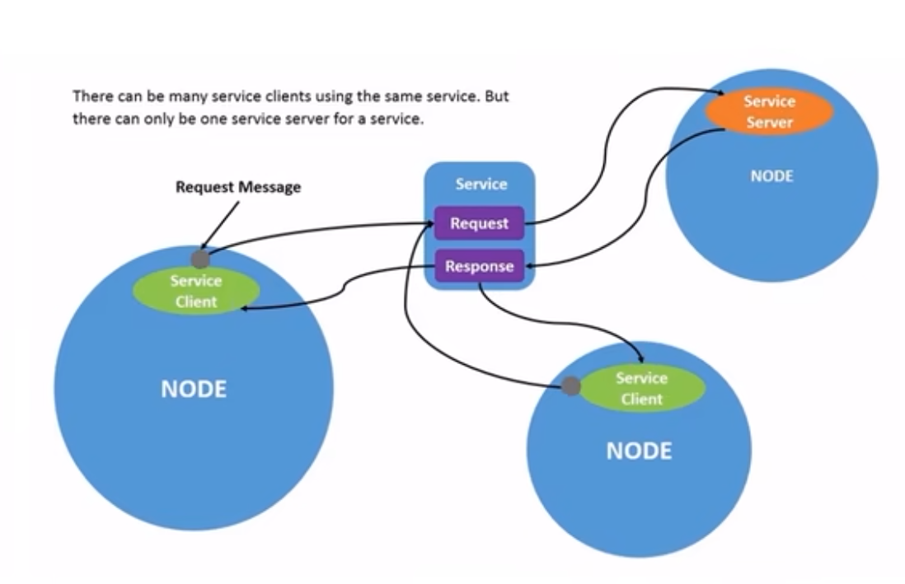
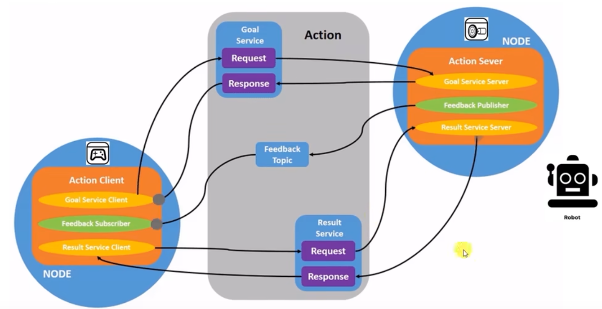
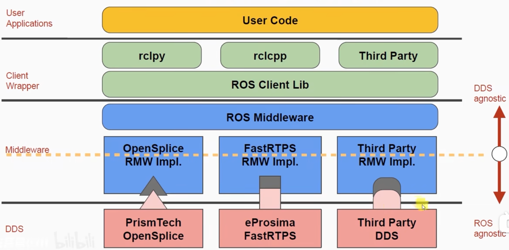

# ROS2
>[ROS2官网数据手册](https://docs.ros.org/en/rolling/index.html)
## 0.Linux基础指令
命令行查询路径:`pwd`
命令行创建新文件:`touch 文件名`
命令行创建新文件夹:`mkdir 文件夹名`
命令行删除文件:`rm 文件名`
命令行删除文件夹:`rm -r 文件夹名`
删除环境变量：`unset http_proxy`
### 0.1 Clash代理指令
>[clash for linux配置blog](https://zhuanlan.zhihu.com/p/693754050)

终端运行脚本启动：
`$HOME/.clash/start_clash.sh`
### 0.2 Github
ubuntu本地的access token:

## 1.ROS2基础CLI指令
**鱼香ROS**调用指令：
```bash
wget http://fishros.com/install -O fishros && . fishros
```
### 1.1 配置环境
#### 1.1.1 创建ROS2工作空间
打开linux命令行终端快捷键: `Ctrl+Alt+T`

创建ROS的工作空间(workspace)：
```bash
mkdir -p ~/ros2_ws/src
cd ~/ros2_ws/src
```
初始化工作空间：
```bash
source /ros2_ws/install/setup.bash
colcon build
```
如果要每次打开终端时自动加载ROS2环境变量，则需要在`.bashrc`文件中添加如下内容：
```bash
source /ros2_ws/install/setup.bash
```
或者输入如下命令：
```bash
echo "source /ros2_ws/install/setup.bash" >> ~/.bashrc
```
#### 1.1.2 创建ROS2包
* 创建C++功能包(package)：
```bash
cd ~/ros2_ws/src
ros2 pkg create --build-type ament_cmake my_package
```
其中`ament_cmake`是ROS2的CMake构建系统。
* 创建Python功能包(package)：
```bash
ros2 pkg create --build-type ament_python my_package
```
#### 1.1.3 编译ROS2包
编译包：
```bash
cd ~/ros2_ws
colcon build --symlink-install
```
* 其中`--symlink-install`选项的作用是告诉 `colcon` 在安装过程中使用符号链接（symlinks）而不是复制文件。
* **编译路径**在`ros2_ws`下，不是`ros2_ws/src`
### 1.2 节点node相关指令
#### 1.2.1 运行ROS2节点node
运行节点：
```bash
ros2 run my_package my_node
```
其中`my_package`是包名，`my_node`是节点名。
#### 1.2.2 查看ROS2节点node
查看节点：
```bash
ros2 node list
```
查看节点信息：
```bash
ros2 node info /node_name
```
查看节点话题：
```bash
ros2 topic list
```
查看节点话题信息：
```bash
ros2 topic info /topic_name
```
节点重映射：允许节点使用不同的名称发布或订阅话题。
```bash
ros2 run my_package my_node --ros-args -r /topic1:=/topic2
```
### 1.3 话题topic相关指令
#### 1.3.1 发布话题指令
运用ros2发布话题指令结构如下：
```bash
ros2 topic pub <topic_name> <msg_type> '<args>'
```
其中`<args>`为消息数据，需要以 YAML 语法输入。假设消息类型为`geometry_msgs/msg/Twist`:
```bash
linear:
  x: 0.5
  y: 0.0
  z: 0.0
angular:
  x: 0.0
  y: 0.0
  z: 0.2
```
发布小海龟速度话题指令:
```bash
ros2 topic pub /turtle1/cmd_vel geometry_msgs/msg/Twist "{linear: {x: 0.5, y: 0.0, z: 0.0}, angular: {x: 0.0, y: 0.0, z: 0.2}}" 
```
#### 1.3.2 查询某话题的消息类型
```bash
    ros2 topic type <topic_name>
```    
### 1.4 服务Service指令
#### 1.4.1 创建服务指令
运用ros2创建服务的ctl指令结构：
```bash
ros2 service call <service_name> <service_type> <args>
```

发布服务指令：
```bash
ros2 service call /service_name std_srvs/srv/Empty "{}"
```
其中，发布创建新海龟指令：
```bash
ros2 service call /spawn turtlesim/srv/Spawn "{x: 0.5, y: 0.5, theta: 0.0}"
```
### 1.5 inteface相关指令
```bash
ros2 interface *
```
### 1.6 action相关指令
```bash
ros2 action *
```


## 2.基本ROS2代码结构
### 2.1 ROS2包结构
最简单的包package具有如下所示的文件结构：
**python**
 ```bash
my_package/
      package.xml
      resource/my_package
      setup.cfg
      setup.py
      my_package/my_code
```
**CMake**
```bash
my_package/
     CMakeLists.txt
     include/my_package/
     package.xml
     src/
```
#### 2.1.1 基础C++节点函数
##### declare_parameter() 函数
**函数作用**：在ROS2中，函数 declare_parameter() 用于声明节点所需的参数，并指定参数的类型和默认值；声明的参数都是该节点特有的。
  **函数原型**：
```c++
template<typename T>
void declare_parameter(const std::string& name,
                       const T& default_value,
                       const rclcpp::ParameterOptions& options = rclcpp::ParameterOptions());
```
**函数参数**：
* name：参数名称；
* deault_value：参数默认值,支持任何 C++ 数据类型，因为这个参数的类型由函数模板决定，而函数模板 T 可以设定为任何值；
* 
### 2.2 pub和sub
#### 2.2.1pub和sub的简单脚本(python)
**publisher**
```python
import rclpy
from rclpy.node import Node
from std_msgs.msg import String
class PublisherNode(Node):
    def __init__(self,name):
        super().__init__(name)
        self.publisher=self.create_publisher(msg_type=String,
                                           topic='chatter',
                                           qos_profile=10)
        self.timer = self.create_timer(timer_period_sec=1.0, 
                                       callback=self.publish)
    def publish(self):
        msg=String()
        msg.data=f'Hello, world!'
        # self.get_logger().info(msg)
        self.publisher.publish(msg)
        self.get_logger().info('Publishing: "%s"' % msg.data)
```
**subscriber**
```python
import rclpy                                       # ROS2 Python接口库
from rclpy.node   import Node                      # ROS2 节点类
from std_msgs.msg import String 
# """
# 创建一个订阅者节点
# """
class SubscriberNode(Node):
        def __init__(self,name):
        super().__init__(name)
        # 创建订阅者
        self.subscription = self.create_subscription(String, 'chatter', self.callback,10)
    # """
    # 回调函数，当接收到消息时被调用
    # msg:接收到的消息
    # """
    def callback(self, msg):
        ("Received: %s" % msg.data)
```
#### 2.2.2 编写setup.py文件
在字典`entry_points`内的`console_scripts`项添加编译后的输出文件子字典:
```python
   entry_points={
        'console_scripts': [
            'talker = beginner_py.pub:main',
            'listener = beginner_py.sub:main'
        ],
    }
```

* 其中talker和listener为节点名称。
#### 2.2.3 运用ROS2 topic传输摄像头数据
##### 一.cv_bridge
常规的cv_bridge包，用于将ROS2和OpenCV进行数据传输。
```python
import rclpy                            # ROS2 Python接口库
from rclpy.node import Node             # ROS2 节点类
from sensor_msgs.msg import Image       # 图像消息类型
from cv_bridge import CvBridge          # ROS与OpenCV图像转换类
import cv2                              # Opencv图像处理库
import numpy as np                      # Python数值计算库
```
### 2.3 service和client

#### 2.3.1 service脚本(python)
```python
from example_interfaces.srv import AddTwoInts
import rclpy
from rclpy.node import Node
class add_Service(Node):
    def __init__(self):
        super().__init__('add_service')
        self.service=self.create_service(AddTwoInts, 'add', self.add_callback)
    def add_callback(self,request, response):
        response.sum = request.a + request.b
        return response
def main(args=None):
    rclpy.init(args=args)
    node = add_Service()
    rclpy.spin(node)
    node.destroy_node()
    rclpy.shutdown()
if __name__ == '__main__':
    main()
```
* 其中`example_interfaces.srv`为自定义消息类型，`AddTwoInts`为服务名称。
  
#### 2.3.2 client脚本(python)
```python
from example_interfaces.srv import AddTwoInts
import rclpy
import sys
from rclpy.node import Node
class Client(Node):
    def __init__(self):
        super().__init__('add_client_py')
        self.cli=self.create_client(AddTwoInts, 'add')
        while not self.cli.wait_for_service(timeout_sec=1.0):
            self.get_logger().info('service not available, waiting again...')
        self.req=AddTwoInts.Request()
    def send_request(self,a,b):
        self.req.a=a
        self.req.b=b
        return self.cli.call_async(self.req)
def main(args=None):
    rclpy.init(args=args)
    node = Client()
    print(sys.argv)
    future = node.send_request(int(sys.argv[1]),
                               int(sys.argv[2]))
    rclpy.spin_until_future_complete(node,
                                     future=future)
    response= future.result()
    node.get_logger().info(
        'Result of add_two_ints: for %d + %d = %d' %
        (int(sys.argv[1]), int(sys.argv[2]), response.sum))
    node.destroy_node()
    rclpy.shutdown()
```
### 2.3 自定义msg和srv
创建自己的msg和srv步骤如下：
1. 在package下新建`msg`和`srv`文件夹，并且在文件夹下新建`.msg`和`.srv`文件。
2. 在`CmakeLists.txt`中添加依赖和srv，msg文件目录。
3. 在`package.xml`中添加`xxx.srv`，`xxx.msg`所需的依赖
4. colcon编译package。
#### 2.3.1 CmakeLists.txt和package.xml所需添加内容
* CmakeLists.txt
```sh
find_package(rosidl_default_generators REQUIRED)
rosidl_generate_interfaces(${PROJECT_NAME}
  "msg/Num.msg"
  "srv/AddThreeInts.srv"
)
```
其中，Num.msg和AddThreeInts.srv为自定义消息和服务，命名要求**首字母大写**。

* package.xml
```sh
  <buildtool_depend>rosidl_default_generators</buildtool_depend>
  <exec_depend>rosidl_default_runtime</exec_depend>
  <member_of_group>rosidl_interface_packages</member_of_group>
```
### 2.4 Action动作

#### 2.4.1 action脚本(python)

## 2.5 Launch文件
ROS2下的launch.py文件最基础的配置如下：
```python
from launch import LaunchDescription
from launch_ros.actions import Node
def generate_launch_description():
    return LaunchDescription([
        Node(
            package='beginner_py',
            namespace='talker',
            executable='talker',
            output='screen'
            ),
        Node(
            package='beginner_py',
            namespace='listener',
            executable='listener',
            output='screen'
            )
            ])
```
其中，`package`为包名，`namespace`为自定义节点命名，`executable`为可执行文件名称。

## 3 DDS
### 3.1 DDS简介

DDS(Data Distribution Service，数据分发服务),2004年由对象管理组织Object Management Group（简称OMG）发布和维护，是一套专门为实时系统设计的数据分发/订阅标准。**DDS强调以数据为中心**，可以提供丰富的*QOS*服务质量策略。
### 3.2 DDS组成
#### 一.DDS Specification
描述了以数据为中心的发布-订阅模型。该规范定义了API和通信语义（行为和服务质量），使消息从消息生产者有效地传递到匹配的消费者。
#### 二.DDSI-RTPS
描述了RTPS（Real Time Publish Subscribe Protocol）协议。该协议通过UDP等不可靠的传输，实现最大努力（Best-Effort）和可靠（reliable）的发布-订阅通信。RTPS是DDS实现的标准协议，它的目的和范围是确保基于不同DDS供应商的应用程序可以实现互操作。ｓ


### 其他问题

#### 1.关于ros2下四元数与欧拉角互转问题
ROS1中使用`from tf.transformations import quaternion_from_euler`导入`quaternion_from_euler()`即可调用，而ROS2中默认没有安装，需要单独`apt`安装:
```sh
sudo apt-get install ros-humble-tf-transformations
```
配置完后，在python下导入包:
```python
import tf_transformations
# 将欧拉角转换为四元数（roll, pitch, yaw）
q = tf_transformations.quaternion_from_euler(roll, pitch, yaw)
# 将四元素转换成欧拉角 
euler = tf_transformations.euler_from_quaternion([x, y, z, w])
```
#### 2. ubuntu网络配置问题
ifconfig配置网线开启和关闭：
```sh
ifconfig eth0 up # 开启网线
ifconfig eth0 down # 关闭网线
```
ifconfig配置网线IP：
```sh
ifconfig eth0 192.168.1.10 # 设置IP地址
```
ifconfig配置网线IP和子网掩码：
```sh
ifconfig eth0 192.168.1.10 netmask 255.255.255.0 # 设置IP地址和子网
```
 **子网掩码的概念**
是一种用于区分IP地址中哪些部分是网络地址，哪些部分是主机地址的数字。

#### 3.Vscode debug ROS2下的C++文件
在`launch.json`文件下的`configurations`字典下添加如下内容：
```json
        {
            "name": "ROS2 Debugger",
            "type": "cppdbg",
            "request": "launch",
            "program": "${workspaceFolder}/install/pavo_lidar/lib/pavo_lidar/pavo_pcd_pub",//ROS2的节点exe文件路径
            "args": [],
            "stopAtEntry": true,
            "cwd": "/",
            "externalConsole": false,
            "MIMode": "gdb",
            "setupCommands": [
                {
                  "description": "Enable pretty-printing for gdb",
                  "text": "-enable-pretty-printing",
                  "ignoreFailures": true
                }
            ]
        }
```

#### 2. C++ Lambda表达式：
```c++
[capture](args) -> return_type { body }:
```
## 相关参考blog
> [Ubuntu22.04 CH340系列串口驱动（没有ttyUSB）问题解决方案](https://blog.51cto.com/u_15473553/5437058)
>